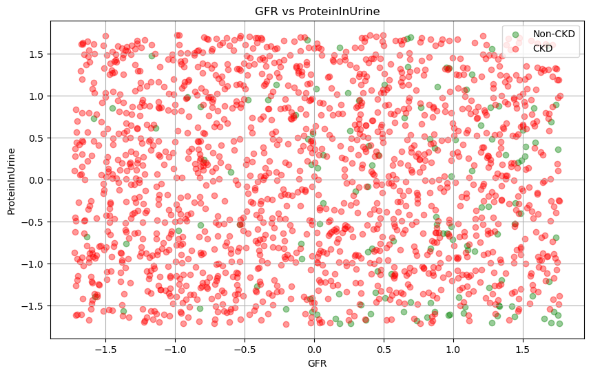
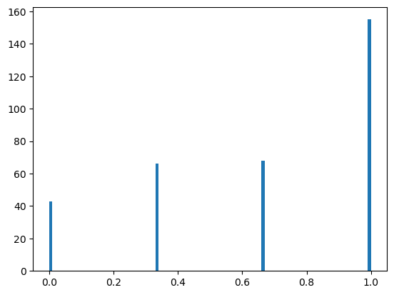
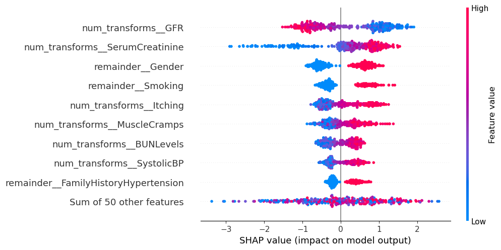

# Team Project 2 - Group 9

- [Team Project 2 - Group 9](#team-project-2---group-9)
- [Description](#description)
- [Introduction](#introduction)
- [Team members](#team-members)
- [Project Approach](#project-approach)
  - [Phase 1](#phase-1)
  - [Phase 2](#phase-2)
- [EDA and Data Analysis](#eda-and-data-analysis)
  - [Data Overview and Cleaning:](#data-overview-and-cleaning)
  - [Exploratory Data Analysis (EDA) and Visualizations](#exploratory-data-analysis-eda-and-visualizations)
    - [Univariate Analysis](#univariate-analysis)
    - [Bivariate Analysis](#bivariate-analysis)
    - [Observations and Outcomes](#observations-and-outcomes)
- [Models and Predictions](#models-and-predictions)
  - [Model Pipeline Creation](#model-pipeline-creation)
  - [Model Tuning and Evaluation](#model-tuning-and-evaluation)
  - [1. Logistic Regression Model](#1-logistic-regression-model)
    - [Logistic Regression Model Dashboard](#logistic-regression-model-dashboard)
    - [Logistic Regression Model Observations](#logistic-regression-model-observations)
  - [2. K-Nearest Neighbors (KNN) Model](#2-k-nearest-neighbors-knn-model)
    - [KNN Model Dashboard](#knn-model-dashboard)
    - [KNN Model Observations](#knn-model-observations)
  - [3. XGBoost (XGBClassifier) Model](#3-xgboost-xgbclassifier-model)
    - [XGBoost (XGBClassifier) Model Dashboard](#xgboost-xgbclassifier-model-dashboard)
    - [XGBoost (XGBClassifier) Model Observations](#xgboost-xgbclassifier-model-observations)
  - [4. Random Forest Classifier Model](#4-random-forest-classifier-model)
    - [Random Forest Model Dashboard](#random-forest-model-dashboard)
    - [Random Forest Model Observations](#random-forest-model-observations)
- [Areas of improvement](#areas-of-improvement)
- [Deliverables](#deliverables)
- [Rules of Engagement](#rules-of-engagement)
  - [Primary Communication Channels:](#primary-communication-channels)
  - [GitHub Workflow:](#github-workflow)
- [Conflict Resolution:](#conflict-resolution)
- [Challenges](#challenges)
- [Lessons Learned](#lessons-learned)
- [Directory structure](#directory-structure)


# Description

This project analyzes data set obtained from patients diagnosed with Chronic Kidney Disease (CKD). The dataset includes demographic details, lifestyle factors, medical history, clinical measurements, medication usage, symptoms, quality of life scores, environmental exposures, and health behaviors. 

Source: https://www.kaggle.com/datasets/rabieelkharoua/chronic-kidney-disease-dataset-analysis

# Introduction

Chronic Kidney Disease (CKD) is a serious and long-term condition that is characterized by gradual decline in kidney function over time. The kidneys are vital organs responsible for filtering waste and excess fluids from the blood, which are then excreted as urine. In CKD, this filtering ability is compromised, leading to a dangerous buildup of waste and fluids in the body.

CKD develops slowly and often remains undetected until it reaches an advanced stage, as early symptoms can be subtle or absent. The disease is called "chronic" because it progresses over an extended period. Various factors can contribute to CKD, including diabetes, high blood pressure, and heart disease. Managing conditions like diabetes and hypertension is crucial to prevent or slow the progression of CKD. Early detection and management are key to controlling CKD and can potentially prevent the need for dialysis or a kidney transplant. By identifying key indicators in health data, it is possible to improve early diagnosis and enhance patient outcomes. Regular testing and monitoring play a significant role in managing CKD effectively.

This dataset includes comprehensive health information for 1,659 patients. Each patient is uniquely identified by a Patient ID. It also includes a confidential column indicating the doctor in charge. This dataset offers a valuable opportunity to explore how various machine learning models can be used to predict CKD at an early stage. This analysis can help patients by providing them with better information so that they can make better decisions about their care. In a supervised learning environment, four machine learning algorithms are expermimented to predict CKD accurately.

By analyzing demographic information, lifestyle factors, health behaviors, environment and occupational exposures, we can uncover disparities in CKD prevalence across different groups and potentially identify gaps in healthcare access.

For a detailed description of the predictors or features in this dataset and their meanings,  please refer to the Data Card section of the Kaggle link [here](https://www.kaggle.com/datasets/rabieelkharoua/chronic-kidney-disease-dataset-analysis).

# Team members

1. Kateryna Skoropad
2. Anjali Deshpande 
3. Zarrin Rasizadeh 
4. Adithya Hadadi

# Project Approach

## Phase 1

The team conducted a brainstorming session using the extensive list in [Team Project Part 1](https://github.com/UofT-DSI/team_project/blob/main/team_project_1.md) provided to us. With the valuable expertise of two doctors in our team, we swiftly decided to focus on medical-related datasets. Our primary considerations centred around the Thyroid and Chronic Kidney Disease (CKD) datasets. Initially, we discussed potential questions that the CKD dataset could help us address. Recognizing the need for preliminary data analysis (EDA) to refine our questions, we explored how various features in the dataset contribute to predicting CKD or non-CKD cases. 

The outcomes of our brainstorming sessions were documented [here](https://github.com/adithya28/team_project/blob/team-project-1/supporting_documents/CKD-data-info-questions.md).

We initiated our work with an empty notebook, CKD.ipynb, initially containing basic metadata blocks. Each block was assigned to specific programmers, detailing tasks and responsibilities. Guided by the principles of Exploratory Data Analysis (EDA) outlined in [this article](https://www.geeksforgeeks.org/what-is-exploratory-data-analysis/), our objective was to apply the statistical learning concepts covered in the 'Applying Statistical Learning' module of our program. Four models were implemented namely  Logistic Regression, K-Nearest Neighbors (KNN), Linear Regression, and Lasso Regression.
 
To streamline our development process, each programmer created a new branch named feature-\<number\> (e.g., feature-1, feature-2) for their assigned tasks. Following completion of each task, a pull request (PR) was created for review. PRs were tagged with the usernames of the assigned reviewers. As part of our commitment to sharing responsibilities, each team member took turns creating, reviewing, and merging pull requests, ensuring that quality was maintained. Throughout the review process, programmers continued iterating on their respective feature branches to refine and enhance their code. When the specific functionality was reviewed and finished, changes were merged into team-project-1 branch to integrate the functionality.

## Phase 2

We started with the notebook file (main source code) from phase 1 of the project, using it as our baseline. The Phase 1 code was reviewed and iterated upon. We studied the section under 'Overall Insights and Areas of Improvement' in the [(Readme)](https://github.com/adithya28/team_project/blob/team-project-1/README-project-1.md) of the first phase. A comprehensive task list was created after discussion, which can be found 
[here](https://drive.google.com/file/d/18sClhYqB4m8HqLS3fzqJMZ6Mwyej4zJ_/view).

There was a need to have a concise display of bar plots and frequency plots in the EDA section of the notebook. We discussed the need for pipelines that included pre-processing steps and classifiers, handling normalization, data balancing with SMOTE and feature engineering. The framework could contain functions that each team member could use for implementation and tuning of various models to make the code more modular and scalable. This approach would ensure fewer bugs and allow passing the same pre-processed data to all models.

Models had to be evaluated using cross-validation techniques, including K-Fold and Stratified K-Fold. There was also a need for hyperparameter tuning using GridSearchCV and Random Search. This functionality had to be built into the functions/framework to be used by each programmer.

We wanted to further evaluate existing models (Logistic Regression and KNN) and try tree-based models like Random Forest and Gradient Boosting Algorithms such as XGBoost. PCA for dimensionality reduction was also to be experimented with for some of the models.

Consistent visualization of results with all the tuned model was to be implemented. We created common functions for visualizating the results using various plots. 
These included ROC curves, confusion matrices, Precision-Recall curves, Probability Prediction plots for model performance, and functions to evaluate Log Loss. We also wanted to implement functions for Permutation Importance plot, Partial Dependence Plot, Feature Importance plot, SHAP and beeswarm plot for model feature importance.

To streamline our development process, we followed the same guidelines as in Phase 1. Each programmer created a new branch named project-2-feature-\<number\> (e.g., project-2-feature-1, project-2-feature-2) for their assigned tasks. Following the completion of each task, a pull request (PR) was created for review. PRs were tagged with the usernames of the assigned reviewers. Each team member took turns creating, reviewing, and merging pull requests, ensuring that quality was maintained. Programmers continued iterating on their respective feature branches to refine and enhance their code based on inputs from other team members. When the specific functionality was finished, changes were merged into the team-project-2 branch to integrate the functionality, thereby automatically closing the Pull Request.

# EDA and Data Analysis

## Data Overview and Cleaning:

The dataset consists of 1659 rows and 54 columns of which the number of features or predictors are 51. Features like 'DoctorInCharge' and 'PatientID' were non-informative and were dropped. 

## Exploratory Data Analysis (EDA) and Visualizations

### Univariate Analysis

1. Summary Statistics: This provided descriptive statistics including count, mean, standard deviation, and percentiles for numerical variables.

2. Histograms were used to visualize the distributions of numerical variables. For instance, the histogram of 'Diagnosis' revealed a skew towards positive CKD diagnoses, indicating an imbalance in the dataset. Specifically, it showed that CKD cases were significantly more prevalent than non-CKD cases.    

   

   Histogram of response variable 'Diagnosis' showing data imbalance

   


3. Scatter plots
   
   | GFR vs ProteinInUrine | GFR vs SerumCreatinine |
   |-----------------------|------------------------|
   |  |  |

   The two scatter plots look very similar with red spots (CKD) scattered throughout the plot and majority of the green spots (non CKD) on the bottom right of the plot. The concentration of green dots (non-CKD patients) on the bottom right of the plot indicates that non-CKD patients generally have higher GFR and lower SerumCreatinine (and lower ProteinInUrine) values. This aligns with the expected physiological relationship where healthy individuals typically have high GFR and low SerumCreatinine (lower ProteinInUrine).

   The weak negative correlation (with a low correlation co-efficient) suggests that within the CKD group, there isn't a strong linear relationship between GFR and SerumCreatinine (as well as ProteinInUrine). This weak correlation might be due to variability in kidney function and creatinine levels across different stages of CKD. CKD is progressive, and the relationship between GFR and SerumCreatinine (ProteinInUrine) might not follow a simple linear pattern.

4. Frequency plots and Bar plots
   
   The frequency plots and bar plots were plotted for categorical variables, illustrating the distribution of data across different categories or groups. They show the count or proportion of observations within each category.

   

   

### Bivariate Analysis

1. Correlation Analysis:

   1. Pearson correlation coefficients were computed between numerical variables and the diagnosis ('Diagnosis') to identify relationships. GFR and SerumCreatinine showed higher co-relation with CKD. Some of the top co-rtelations found are listed here:
    
      | Index | Feature 1               | Feature 2              | Co-relation Coefficient |
      |-------|--------------------------|------------------------|-------------------------|
      | 1     | Diagnosis                | SerumCreatinine        | 0.201125                |
      | 2     | Diagnosis                | GFR                    | -0.175988               |
      | 3     | Diagnosis                | Itching                | 0.100652                |
      | 4     | Diagnosis                | FastingBloodSugar      | 0.095694                |
      | 5     | Diagnosis                | MuscleCramps           | 0.094811                |
      | 6     | Diagnosis                | BUNLevels              | 0.093097                |
      | 7     | Diagnosis                | ProteinInUrine         | 0.090014                |
      | 8     | Diagnosis                | SystolicBP             | 0.083528                |


   3. Visualized correlations using a heatmap, highlighting significant correlations such as SerumCreatinine positively correlating with Diagnosis and Glomerular Filtration Rate (GFR) negatively correlating.

      
   
2. Relationships with CKD:

    Box Plots: Compared distributions of numerical variables between CKD and non-CKD groups. Observations included higher median age, higher systolic BP, poorer HbA1c control, and lower GFR among CKD patients.
    
    
   

###  Observations and Outcomes

**Health Indicators:**

Age, Systolic BP, HbA1c levels, ACR, BUN levels, GFR, Serum creatinine, and Protein in urine were identified as significant indicators associated with CKD. Significant correlations (positive) were found between SerumCreatinine levels and the presence of CKD. GFR showed a negative correlation with CKD, indicating lower GFR values were associated with a higher likelihood of CKD diagnosis.

**Distribution Insights:**

Gender balance, ethnic distribution, socioeconomic status, education levels, smoking habits, and family medical history provided insights into the demographics and lifestyle factors of the population.

# Models and Predictions

## Model Pipeline Creation

A model pipeline was designd to emphasize a structured approach to data handling and model training. The **Preprocessing Pipeline** was built to standardize numeric features, optionally applying **Principal Component Analysis (PCA)** for dimensionality reduction. Categorical variables were encoded using **one-hot encoding**. Binary features were retained in their original format. This integrated pipeline ensured that all data transformations were consistently applied, preparing the data for subsequent modeling. By orchestrating these steps within a single pipeline, the process became streamlined and manageable, setting the stage for model training.

The data was split into training, validation, and test sets as follows:

**Initial Split:** The data was first divided into 80% for training and 20% for testing.

**Second Split:** The 80% training set was then further split into 80% for training and 20% for validation.

## Model Tuning and Evaluation

The **model tuning and evaluation** process was designed to enhance the model’s performance and reliability through systematic refinement. Initially, **SMOTE** was used to address any class imbalances in the dataset. The pipeline, which included preprocessing and model training, was optimized using cross-validation, specifically **StratifiedKFold or KFold**, to ensure robust performance assessment and generalizability. **Grid search or randomized search** was employed to explore various hyperparameter settings, identifying the best configuration. Model performance was assessed using metrics such as accuracy, precision, recall, F1 score, and ROC AUC. This evaluation ensured that the model was well-tuned and effective for deployment in real-world scenarios.

## 1. Logistic Regression Model

### Logistic Regression Model Dashboard

| Confusion Matrix | ROC Curve |
|------------------|-----------|
|  |  |

| Precision-Recall Curve | Permutation Importance |
|------------------------|------------------------|
|  |  |

| Partial Dependence Plots | 
|--------------------------|
|  | 


| SHAP Waterfall | SHAP Beeswarm |
|----------------|---------------|
| |  |

### Logistic Regression Model Observations
-----

**Training Accuracy and Metrics**

*Training Accuracy*: 0.91: This means the model correctly predicted the class for 91% of the training samples.

*Training Classification Report:*

Precision: Measures the accuracy of the positive predictions. For class 1, precision is 0.91, meaning 91% of the samples predicted as class 1 are actually class 1.

Recall: Measures the ability to find all positive samples. For class 1, recall is 0.91, meaning the model identified 91% of the actual class 1 samples.

F1-score: The harmonic mean of precision and recall. For class 1, the F1-score is 0.91.

Training ROC AUC: 0.97: The ROC AUC of 0.97 indicates excellent performance, as it is very close to 1. This means the model is very good at distinguishing between the two classes on the training data.

**Validation Accuracy and Metrics**

*Validation Accuracy:* 0.89: The model correctly predicted the class for 89% of the validation samples.

*Validation Classification Report:*

The model seems to perform well for class 1 (precision = 0.95, recall = 0.93, F1-score = 0.94) but poorly for class 0 (precision = 0.32, recall = 0.40, F1-score = 0.36).

Macro average: Averages metrics across classes, treating all classes equally. Macro average scores are lower due to the poor performance on class 0.

Weighted average: Takes class frequencies into account, showing better performance metrics due to the model's better performance on the majority class (1).

Validation ROC AUC: 0.73: Indicates good performance, but lower than the training ROC AUC. This suggests the model might be overfitting or not generalizing well to unseen data.

**Test Accuracy and Metrics**

*Test Accuracy:* 0.85: The model correctly predicted the class for 85% of the test samples.

*Test Classification Report:*

The model performs poorly on class 0 (precision = 0.21, recall = 0.38, F1-score = 0.27).

For class 1, the model performs well (precision = 0.95, recall = 0.89, F1-score = 0.92).

Macro average: Again shows lower values due to poor performance on class 0.

Weighted average: Shows better performance metrics due to the better performance on the majority class (1).

Test ROC AUC: 0.74: Similar to the validation ROC AUC, indicating moderate performance. This is lower than the training ROC AUC, which suggests potential overfitting.

**Best Parameters**

Best Parameters: {'classifier__solver': 'liblinear', 'classifier__C': 10}: These are the best parameters found through hyperparameter tuning:
solver='': This is the optimization algorithm used for training the logistic regression model.
C=10: This is the regularization parameter. The value 10 indicates the strength of regularization, balancing model complexity and fit.

**Plot Observations**

*SHAP waterfall and beeswarm plot:*

Serum Creatinine consistently has a strong positive impact on the model's predictions across multiple instances, especially when its value is high.
GFR consistently has a strong negative impact, especially when GFR values are high, indicating better kidney function.
Features like Smoking, Edema, Gender and Family History of Hypertension show moderate but consistent impacts on the model's predictions.

The less important features are Urinary Tract Infections, Diuretics, Family History of Diabetes, Edema, and Gender. Additionally, the "Sum of 50 other features" group suggests that many features contribute minimally to the model’s decision-making process.

A log loss of 0.38 suggests that the model’s predicted probabilities are reasonably close to the actual outcomes but there might be room for improvement. It’s essential to compare this log loss against benchmarks and other models.

*Partial Dependency plot*

The Partial Dependency plots show that Age, SystolicBP, FastingBloodSugar, ProteinInUrine, Serun Creatinine, BUN Levels, SerunElectrolytePotassium have strong postive positive impact on predicting CKD cases. The plot also shows inverse realtion with positive CKD cases. 

The Partial Dependence Plot (PDP) for a logistic regression model shows an inverse relationship between ACR (Albumin-to-Creatinine Ratio) and HbA1C with Chronic Kidney Disease (CKD), and this relationship seems counterintuitive or incorrect based on domain knowledge. Tt suggests potential issues with the model or the data.

*Precision Recall curve*

The Precision Recall curve (PR) shows that for recall values up to 0.1, precision is very high (1), indicating that the model’s predictions are highly accurate when it does classify positives. As recall increases beyond 0.1, precision initially rises to 0.98 before eventually decreasing to 0.93 following a typical PR curve. This pattern, including the subsequent variations, shows  the model's performance fluctuations across instances. Overall, the model maintains high precision at low recall but shows a slight decrease in precision as recall increases, with some variability in precision due to the model's performance.

*Permutation Importance plot*

The permutation importance plots shows features that differ significantly from those identified by feature importance metrics (such as those from SHAP values) or from visualizations like beeswarm plots, it suggests that there are some complex feature interactions. If features interact in a complex manner, permutation importance might highlight features that are crucial in these interactions.  In cases where multiple features are highly correlated, permutation importance highlights one feature over others if it more significantly impacts model performance when permuted.

************************

## 2. K-Nearest Neighbors (KNN) Model

### KNN Model Dashboard

| Confusion Matrix | ROC Curve |
|------------------|-----------|
|  |  |

| Predicted Probabilities Histogram | 
|-----------------------------------|
|  | 

| Precision-Recall Curve | Permutation Importance |
|------------------------|------------------------|
|  |  |

| Partial Dependence Plots |
|--------------------------|
|  | 

### KNN Model Observations
----
<u>**Training Accuracy and Metrics**</u>

*Training Accuracy:* 0.78: The model correctly predicted the class for 78% of the training samples.

<u>*Training Classification Report:*</u>

*Precision:* Class 0 has a precision of 0.70, and class 1 has a precision of 1.00, showing better performance on class 1.

*Recall:* Class 0 has a recall of 1.00, while class 1 has a recall of 0.56, indicating that class 0 is fully captured, but class 1 is less so.

*F1-Score:* Class 0 has an F1-score of 0.82, and class 1 has 0.72, reflecting the balance of precision and recall for each class.

*Training ROC AUC:* 1.00: The ROC AUC of 1.00 indicates perfect performance on the training data, showing that the model flawlessly distinguishes between classes.

<u>**Validation Accuracy and Metrics**</u>

*Validation Accuracy:* 0.40: The model achieved an accuracy of 40% on the validation set, correctly predicting the class for 40% of the samples.

<u>*Validation Classification Report:*</u>

*Precision:* Class 0 has a precision of 0.09, and class 1 has a precision of 0.96, showing high precision for class 1 but poor precision for class 0.

*Recall:* Class 0 has a recall of 0.80, while class 1 has a recall of 0.37, indicating that class 0 is identified better than class 1.

*F1-Score:* Class 0 has an F1-score of 0.17, and class 1 has 0.53, reflecting the overall balance between precision and recall.

*Validation ROC AUC:* 0.56: This ROC AUC indicates only modest performance, suggesting the model is less effective on the validation set.

<u>**Test Accuracy and Metrics**</u>

*Test Accuracy:* 0.40: The model achieved an accuracy of 40% on the test set, correctly predicting the class for 40% of the samples.

<u>*Test Classification Report:*</u>

*Precision:* Class 0 has a precision of 0.08, and class 1 has a precision of 0.94, indicating strong performance for class 1 but very poor performance for class 0.

*Recall:* Class 0 has a recall of 0.71, while class 1 has a recall of 0.38, showing that class 0 is identified more reliably than class 1.

*F1-Score:* Class 0 has an F1-score of 0.15, and class 1 has 0.54, reflecting better performance for class 1 but poor overall balance.

*Test ROC AUC:* 0.56: This ROC AUC suggests that the model's performance on the test set is similar to that on the validation set, indicating potential issues with generalization.

**Best Parameters**

*Best Parameters:* {'classifier__metric': 'manhattan', 'classifier__n_neighbors': 3, 'classifier__weights': 'uniform'}: These parameters were selected to balance model complexity and performance effectively.

**Plot Observations**

The KNN model shows poor performance.

PCA Analysis identifies several important features, but the high number of components suggests complex feature interactions. Confusion Matrix and Log Loss (4.97) indicates moderate to poor classification performance, with significant room for improvement in predicting both classes.

ROC AUC of 0.65 shows that the model performs better than random guessing but is not highly effective at distinguishing between classes. Non-CKD has a precision of 0.08, and CKD has a precision of 0.94, indicating strong performance for CKD but very poor performance for non-CKD. Non-CKD has a recall of 0.71, while CKD has a recall of 0.38, showing that non-CKD is identified more reliably than CKD. Non-CKD has an F1-score of 0.15, and CKD has 0.54, reflecting better performance for CKD but poor overall balance.

Permutation Importance plot highlights key features that impact the model’s predictions, but this list differs from the list of features listed in the Feature Importance plot. 


The Partial Dependence Plots suggests model interpretability issues, with incorrect relationships identified for several critical features like HbA1c, SerumCreatinine, GFR etc. The Partial Dependence Plot (PDP) for a logistic regression model shows an inverse relationship between ACR (Albumin-to-Creatinine Ratio) and HbA1C with Chronic Kidney Disease (CKD), and this relationship seems counterintuitive or incorrect based on domain knowledge. It suggests potential issues with the model or the data.

The Precision Recall curve (PR) the models shows that precision decreases from 1 to 0.93 steadily as recall increases from 0 to 1. After this linear increase, precision drops from 0.97 to 0.93 in a curved fashion as recall continues to increase. This pattern indicates that while the model maintains high precision initially, it experiences a gradual decrease in precision as recall increases, with a noticeable linear phase followed by a curved decline.

************************

## 3. XGBoost (XGBClassifier) Model

### XGBoost (XGBClassifier) Model Dashboard

| Confusion Matrix | ROC Curve |
|------------------|-----------|
|  |  |

| Predicted Probabilities Histogram | 
|-----------------------------------|
|  | 

| Precision-Recall Curve | Permutation Importance |
|------------------------|------------------------|
|  |  |

| Partial Dependence Plots | Feature Importance |
|--------------------------|--------------------|
|  |  |


| SHAP Waterfall | SHAP Beeswarm |
|----------------|---------------|
| |  |


### XGBoost (XGBClassifier) Model Observations
----
<u>**Training Accuracy and Metrics**</u>

*Training Accuracy:* 1.00: This means the model correctly predicted the class for 100% of the training samples.

<u>*Training Classification Report:*</u>

*Precision:* For both class 0 and class 1, precision is 1.00, indicating that 100% of the samples predicted as either class were correct.

*Recall:* For both class 0 and class 1, recall is 1.00, meaning the model identified all actual samples of each class.

*F1-Score:* For both class 0 and class 1, the F1-score is 1.00, reflecting perfect balance between precision and recall.

*Training ROC AUC:* 1.00: The ROC AUC of 1.00 indicates perfect performance, showing that the model flawlessly distinguishes between the two classes on the training data.

<u>**Validation Accuracy and Metrics**</u>

*Validation Accuracy:* 1.00: The model achieved perfect accuracy on the validation set, correctly predicting the class for 100% of the samples.

<u>*Validation Classification Report:*</u>

*Precision:* For both class 0 and class 1, precision is 1.00, meaning 100% of predicted classes were correct.

*Recall:* For both class 0 and class 1, recall is 1.00, indicating the model identified all actual samples of each class.

*F1-Score:* For both class 0 and class 1, the F1-score is 1.00, reflecting perfect precision and recall balance.

*Validation ROC AUC:* 1.00: This indicates excellent performance, similar to the training set, with perfect class separation.


<u>**Test Accuracy and Metrics**</u>

*Test Accuracy:* 0.91: The model correctly predicted the class for 91% of the test samples.

<u>*Test Classification Report:*</u>

*Class 0:* Precision is 0.33, recall is 0.25, and F1-score is 0.29, showing poor performance on this class.

*Class 1:* Precision is 0.94, recall is 0.96, and F1-score is 0.95, indicating strong performance for this class.

*Macro Average:* Precision is 0.64, recall is 0.61, and F1-score is 0.62, reflecting lower values due to poor performance on class 0.

*Weighted Average:* Precision is 0.90, recall is 0.91, and F1-score is 0.90, showing better performance metrics weighted by class frequency.

*Test ROC AUC:* 0.82: Indicates good performance, though not as high as the training and validation ROC AUC, suggesting some degree of overfitting.

**Best Parameters**

{'classifier__alpha': 1, 'classifier__colsample_bytree': 0.9, 'classifier__gamma': 0.1, 'classifier__lambda': 1, 'classifier__learning_rate': 0.1, 'classifier__max_depth': 5, 'classifier__min_child_weight': 1, 'classifier__n_estimators': 300, 'classifier__subsample': 0.9}: These parameters were optimized to balance the model's complexity and performance effectively.

**Graphs**

*Log Loss:* 0.233

The low log loss value indicates that the model’s probabilistic predictions are well-calibrated.

*Predicted Probability Histogram:*

Shows a distribution with most predictions close to 1, indicating that the model is highly confident in its predictions.

*Precision-Recall Curve:*

The curve starts at 1 and steps down before following a typical precision-recall curve, indicating that most predicted probabilities are high. The Precision Recall curve (PR) shows that for recall values up to 0.0.5, precision is very high (1), indicating that the model’s predictions are highly accurate when it does classify positives. As recall increases beyond 0.05, precision initially rises to 0.99 before eventually decreasing to 0.93 following a typical PR curve. This reflects the model's high initial precision and subsequent decrease as more positives are identified. The curve follows a typical PR shape with fluctuations, illustrating the model's performance variations across different instances. Overall, the model maintains high precision at low recall but experiences a slight decrease in precision as recall increases, with some variability in precision due to performance fluctuations.

*ROC Curve:*

The ROC curve is stepped rather than smooth but resembles a typical ROC curve, with an area of 0.82.

*Partial Dependence Plots:*

The relationships shown are accurate for key features such as systolic BP, fasting blood sugar, HbA1c, serum creatinine, BUN levels, GFR, protein in urine, and ACR. These plots correctly reflect the direction of change with respect to feature values.

*Permutation Importance plot:*

The permutation importance plots shows features that differ significantly from those identified by feature importance metrics (such as those from feature importance plot) or from visualizations like beeswarm plots, it suggests that there are some complex feature interactions. If features interact in a complex manner, permutation importance might highlight features that are crucial in these interactions.  In cases where multiple features are highly correlated, permutation importance highlights one feature over others if it more significantly impacts model performance when permuted.

*SHAP waterfall and beeswarm plot:*

Serum Creatinine, BUN levels, ACR, Systolic BP, Itching, Muscle Cramp, Family History of Hypertension consistently have a strong positive impact on the model's predictions across multiple instances, especially when its value is high.
GFR consistently has a strong negative impact, especially when GFR values are high, indicating better kidney function.

*Summary*

The XGBoost model demonstrates good performance on both training and validation datasets, with very good accuracy, precision, recall, and F1-scores. However, the model shows a drop in performance on the test set, particularly for non-CKD, suggesting overfitting. The feature importance and partial dependence plots indicate that the model is effectively capturing key relationships, although the test performance suggests room for improvement.

************************

## 4. Random Forest Classifier Model

### Random Forest Model Dashboard

| Confusion Matrix | ROC Curve |
|------------------|-----------|
|  |  |

| Precision-Recall Curve | 
|------------------------|
|  | 

| Partial Dependence Plots | Feature Importance |
|--------------------------|--------------------|
|  |  |

### Random Forest Model Observations

Training Performance: Precision, recall, and F1-score for both classes (0 and 1) are all perfect (1.00), indicating that the model performed flawlessly on the training data.

Validation Performance: Class 0  (Not CKD) has low precision (0.50) and recall (0.10), while Class 1 (CKD) has high precision (0.93) and recall (0.99). The F1-score for Class 0 is very low (0.17), whereas Class 1 (CKD) has a high F1-score (0.96).

Test Performance: Class 0 (Not CKD) precision and recall are both zero, indicating that the model fails to correctly classify instances of Class 0 (Not CKD). Class 1 maintains high precision (0.93) and recall (0.98), showing that it classifies Class 1 instances well.

The Random Forest model achieved perfect performance on the training data with 100% accuracy and a ROC AUC of 1.00, indicating potential overfitting. On the validation set, the model's accuracy dropped to 92%, with significant challenges in classifying the minority class (Not CKD), which had low precision, recall, and F1-score. The test results further showed a slight decrease in accuracy to 91%, with the model failing to classify Class 0 (Not CKD) instances while maintaining high performance for Class 1. The ROC AUC for the test set was 0.76, reflecting some discrimination capability.


************************

# Areas of improvement

1. **Explore Feature Combinations**
   - Combine features such as age and BMI; Fasting Blood Sugar and HbA1C together.
   - Research if SystolicBP and DiastolicBP could be effectively combined.

2. **Explore Other Models**
   - Increase the complexity of current models to improve the ability to learn characteristics of class 0.
   - Experiment with Convolutional Neural Networks (CNNs).

3. **Feature Reduction and Feature Selection**
   Apply feature selection techniques to reduce the number of features and enhance model performance. 
   - **Choose and Evaluate Features**: Select a subset of the most important features based on specific criteria and use a model to evaluate this subset. Compare the performance of models trained with different feature subsets to determine the best trade-off between performance and complexity.
   - **Feature Selection Methods**:
     - **Chi-Square Test**: Assess the independence between categorical features and the target variable.
     - **ANOVA (Analysis of Variance)**: Test for significant differences in means for numerical features.
     - **Recursive Feature Elimination (RFE)**: Recursively remove features and build models to evaluate their impact on performance. RFE can be computationally expensive with large feature sets.
   - **Dimensionality Reduction**: This project experimented with Principal Component Analysis (PCA) using the KNN model. Consider exploring Linear Discriminant Analysis (LDA) as well.

4. **Explore Drug Relations**
   Investigate the correlation between CKD development and specific classes of drugs, such as diuretics, antidiabetic drugs, and NSAIDs. Examine these drugs in detail rather than as broad categories.

5. **Experiment Tracking Tools**
   Use tools like MLflow, Sacred, or TensorBoard for managing and analyzing machine learning experiments.

# Deliverables

1. Notebook file with EDA and models: [CKD.ipynb](https://github.com/adithya28/team_project/blob/team-project-2/src/CKD.ipynb)

2. Supporting documention: [CKD-data-info-questions.md](https://github.com/adithya28/team_project/blob/team-project-2/supporting_documents/CKD-data-info-questions.md)

3. [README file](https://github.com/adithya28/team_project/blob/team-project-2/README.project-2.md)

4. Video presentation of each team member:

    * Kateryna Skoropad - [Add Link Here]
    * Anjali Deshpande - [Add Link Here]
    * Zarrin Rasizadeh - [https://drive.google.com/file/d/1AO7-40nrwJsMU-rhD2tKt0ICxG2aGgZk/view?usp=sharing]
    * Adithya Hadadi - [https://drive.google.com/file/d/1xI7s4K_jB-_rngttjc371p8bQIpGr_0n/view?usp=sharing]

# Rules of Engagement

## Primary Communication Channels: 

Slack was used for day-to-day communication, while Microsoft Teams and Zoom was utilized for scheduled meetings and screen sharing.

## GitHub Workflow:

* Each team member worked on individual feature branches (e.g., project-2-feature-1, project-2-feature-2 etc) for developing code.

* No direct changes were to be made to the team-project-2 branch. 

* Pull requests (PRs) were created for each feature or significant update.

* PRs were reviewed by another team member before merging into the team-project-2 branch. The comment section of PR was used to add review comments to help both the reviewer and the coder understand the changes.

* Subsequent reviews of the same file were done on the same pull request. The comment section of pull request was used to communicate the desired changes. Re-review was performed based on these comments. 

* On approval by another team-member the PR was merged to team-project-2 branch.

* Changes in team-project-2 were not to be merged into team-project-1. The two branches were kept independent of each other. 

# Conflict Resolution:

* Team members collaborated to resolve conflicts during code merging.

* Persistent issues were escalated to other team members who had IT experience for resolution.

# Challenges

During the execution of the team project, we encountered the following challenges:

* Varying levels of technical skill proficiency.
* Insufficient time.
* Lack of experience of majority of team members working in data analysis area.
* Resolving merge conflicts: Errors occurrences when combining team member's code.


# Lessons Learned

In teamwork, open communication, mutual respect, and assistance allow us to overcome any difficulties.


# Directory structure

```markdown
|-- data
|---- processed
|---- raw
|---- sql
|-- reports
|   | -- images
|         |---- *.png
|-- src 
    |-- CKD.ipynb
|-- supporting_documents
    | -- supporting_documents/CKD-data-info-questions.md
|-- README-project-1.md
|-- README-project-2.md
|-- .gitignore
```


