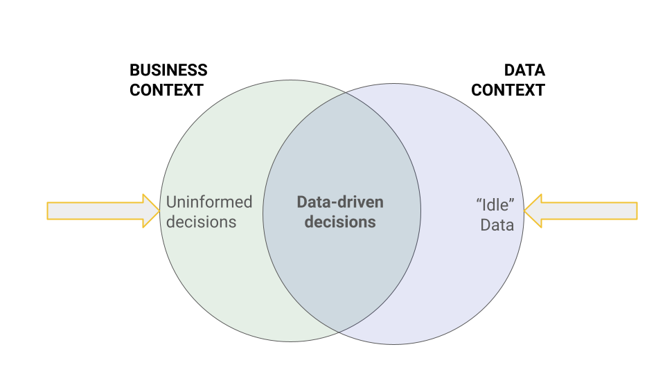
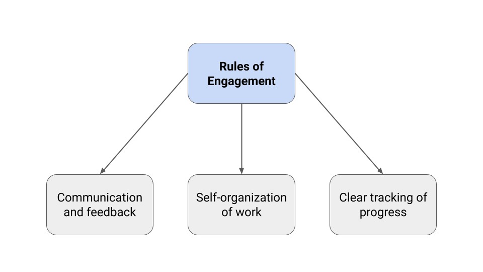
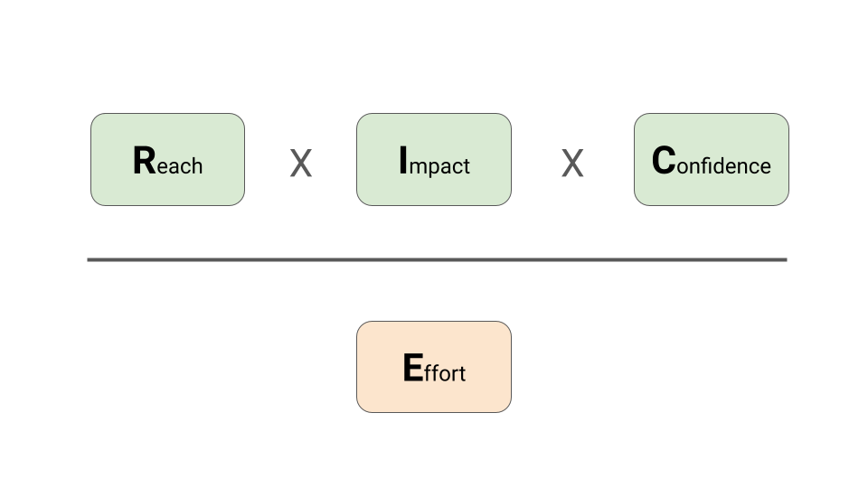
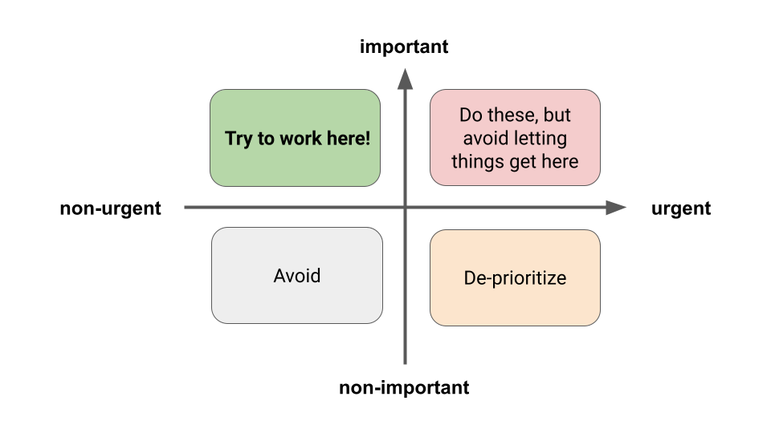

# Team Project
```
$ echo "Data Sciences Institute"
```

---

## Yesterday

1. Team Project Guidelines

2. Developing a Project Plan

3. Git Review: Resolving Merge Conflicts

---

### Goal

___Develop a program that uses data creatively to solve a problem or provide insights that have a positive business impact.___

---

### See [Team Project Part 1](https://github.com/UofT-DSI/team_project/blob/main/team_project_1.md) for requirements.

---

## [The Five Orders of Ignorance](https://www.5oi.org/the-five-orders-of-ignorance)

**A "meta-model of ignorance" that can help us put the unknowns of projects into context.**

* The goal is to move down the ladder to 0OI.
* 2OI and 3OI is where we should be spending most of our production energy.

---

# Developing a project idea

---

### How do we create business value?

* We want to allocate our resources (eg. money, employees) in the way that generates the most value.
    * How do we enable the decision makers?

*Strategic decisions should be based on data!*



---
## Developing a project plan

1. Understand the business context.
2. Identify an opportunity.
3. Scope your analysis.
4. Develop your solution.
5. Present results and recommendations.

---

## Developing a project plan

**Check:** Are your insights *actionable*?

**Check:** How robust is your analysis? *Quantify!*

**Check:** What are the *risks/caveats/unknowns?*

---

## FAQs from yesterday:

* **How do you submit your videos?**
    * The README should include links to each team member's video.
    * The location where you host it is up to you, but we strongly recommend posting your video to your YouTube account (or unlisted). That way, potential future employers will be able to access it along with your project.

---

## FAQs from yesterday:

* **We have an idea but someone else has already completed a similar analysis. Can we still use that idea?**
    * It may be difficult to find a problem that nobody has worked on already, but you should still bring something new to your solution. This is about being creative!
    * If your project is motivated by work that is already public, cite this in your README file.
    * If your goal is to improve on work that has already been done, state this explicitly in your README. Discuss how you want to improve the analysis.

---

## FAQs from yesterday:

* **When is the project due?**
    * The project is due this upcoming Sunday (June 23).

---

## FAQs from yesterday:

* **Are there example projects to refer to?**
    * We will not provide any specific examples since we want you to develop your idea on your own, and showcase your creativity.
    * Some example of how regression can be applied in business:
        * [simplilearn](https://www.simplilearn.com/tutorials/excel-tutorial/regression-analysis#)
        * [datagran](https://blog.datagran.io/posts/regression-analysis-for-business)
    * Some examples of analyses:
        * [Stock Price Prediction](https://www.kaggle.com/code/riddhidalal/stock-price-prediction-using-python)
        * [Students Performance Analysis](https://www.kaggle.com/code/fxnanda/students-performance-dataset-analysis)
        * Many others on Kaggle!

---

## FAQs from yesterday:

* **What are the exact steps to set up the GitHub repository for your team?**

    1. One team members forks the [DSI `team_project`](https://github.com/UofT-DSI/team_project) repository onto their personal account.
    2. Every other team member clones the repository.
    3. One team member creates the `team-project-1` branch and pushes it to GitHub. This will be the "working" branch for your project.
    4. Each team member should be developing in a feature branch that is branched off of `team-project-1`.
    5. When features are completed, those branches should be merged back into `team-project-1` with a pull request.

---

## FAQs from yesterday:

* **What are the exact steps to set up the GitHub repository for your team?**

    6. Each team member must submit at least one of these PRs.
    7. Each PR must be reviewed by at least one other team member. We recommend assigning different reviewers to each PR, as one of the requirements is that each team member review at least one PR.
    8. When the project is completed, the `team-project-1` branch should be the final working version.
    9. The project is submitted by submitting a PR to merge the `team-project-1` branch into the `main` branch of your **forked** repository. Any team member can submit this.

---

## Today

1. Presenting your work and sharing it with others.

2. Rules of engagement and strategies for effective teamwork.

---
# Presenting your work
---

## Presenting your work

1. Understand your target audience.
2. Clearly articulate the takeaways.
3. Highlight the value added.

---

## 1. Understand your target audience

* What are their goals? What is their jurisdiction?

* Determine which details about your project they *need* to know; consider what they know about it already.

--- 

## 1. Understand your target audience

**Example:** We are presenting our analysis of office space usage to the department heads who assign seating. They are not technical, but understand the company is paying more than it needs to for real estate. Furthermore, they have their own prior perspectives on office space utilization.

--- 

## 1. Understand your target audience

**Example:** We are presenting our analysis of office space usage to the department heads who **assign seating**. They are not technical, but understand **the company is paying more than it needs to for real estate**. Furthermore, they have their own prior perspectives on office space utilization.

* **What are their goals and jurisdiction?**
    * They want to make the most efficient use out of office space, and minimize real estate costs where possible.
    * They are able to change how team seating is assigned.

--- 

## 1. Understand your target audience

**Example:** We are presenting our analysis of office space usage to the department heads who assign seating. **They are not technical**, but understand the company is paying more than it needs to for real estate. Furthermore, they have their own prior perspectives on office space utilization.

* **Determine which details about your project they *need* to know; consider what they know about it already.**
    * They understand that you are investigating ways to decrease real estate costs.

---


* **Determine which details about your project they *need* to know; consider what they know about it already.**
    * They **should** know the factors that you are considering.
        * Office usage broken down by a variety of factors (team, day of the week, season, etc...).
        * Amount of assigned seating.
        * Amount of flexible seating.
        * Time spend in meetings (by individual and team).
    * They **should** know your data sources.
    * They **do not** need to know how you are cleaning your data, what libraries you are using, or your statistical techniques.
        * A technical audience (eg. software architect reviewing your work) would want to know these details.

--- 

## 2. Clearly articulate the takeaways

* Ensure that your audience understands the most important information.

* Don't add unnecessary detail, but be prepared to speak in depth if asked.

* Highlight the actionable insights.

--- 

## 2. Clearly articulate the takeaways

### Tips for Amazon Writers:

1. Make sentences clear and concise (less than 30 words).
    * "Due to the fact that..." -> "because".
2. Replace adjectives with data.
    * "We improved performance" -> "we reduced latency from 10ms to 1ms."
3. Eliminate weasel words.
    * "Nearly all customers." -> "87% of Amazon Prime members."
4. Reply to questions with one of four "Amazon answers":
    * Yes / No / a number / I don't know (and will follow up when I do)

---

## 2. Clearly articulate the takeaways

**Example:** Our company could reduce real estate overhead, without restricting the ability of employees to work where they want to (based on current office usage), if we removed the assigned seating for 10% of teams but updated 25% of our office space to be flexible seating.

---

## 2. Clearly articulate the takeaways

**Example:** Our company could **reduce real estate overhead**, without restricting the ability of employees to **work where they want** (based on current office usage), if we **removed the assigned seating for 10% of teams** but **updated 25% of our office space** to be flexible seating.

* **Ensure that your audience understands the most important information**.
    * Align your takeaways to your audience's goals.
    * Be specific.
    * ***Communicate the actionable insights.***

---

## 2. Clearly articulate the takeaways

**Example:** Our company could **reduce real estate overhead**, without restricting the ability of employees to **work where they want** (based on current office usage), if we **removed the assigned seating for 10% of teams** but **updated 25% of our office space** to be flexible seating.

* **Don't add unnecessary detail, but be prepared to speak in depth if asked.**
    * Understand the rationale behind the numbers and be ready to justify your logic.
    * Eg. there may be no need to list specific floors or sections that assigned seating should be removed from at this time, but you should have some ideas.


---

## 3. Highlight the value added

* Quantify as much as possible.

* Indicate how your work improves over previous work or the status quo.

---

## 3. Highlight the value added

**Example:** Updating the office spaces would add 5% to our real estate costs over the next year, but would save 10% per year once the new seating is implemented.

---

## 3. Highlight the value added

**Example:** Updating the office spaces **would add 5% to our real estate costs** over the next year, but **would save 10% per year** once the new seating is implemented.

* **Quantify as much as possible.**
    * Provide specific % or $ amounts if able, along with any uncertainties.
* **Indicate how your work improves over previous work or the status quo.**
    * This will incentivize the action that you are recommending.

---

# Rules of engagement and strategies for effective teamwork
---

### How did yesterday go?

Do you think your team was organized well?

What could be improved?

Would the others on your team agree with you?

---

## Rules of engagement

### Successful teams:

1. Have strong communication.

2. Have a clear undertanding of everyone's role on the team and work collaboratively towards a common goal.

3. Always understand what needs to be done, what is in progress, and what has been done.

---

## Rules of engagement

* Every team may land on slight different rules of engagement!

* The key is awareness of what works and what doesn't, and adjust accordingly.

* Iteration is good!

---

## Rules of engagement

* **Rules must be explicit**.

* Miscommunication happens when rules are left up to individual interpretation.

---

 

---
## Communication and feedback

1. **Feedback as a habit**. A feedback framework helps teams focus on improving processes instead of laying blame.

2. **Respectful and honest communication**. For discussions to be productive, team members must feel able to both speak their minds and discuss their mistakes without judgement.

---

1. **Feedback as a habit**. A feedback framework helps teams focus on improving processes instead of laying blame.

* **Bad example:**
    * Team members only communicate when something has gone wrong to figure out who made a mistake.
* **Good example:**
    * Your team schedules 10 minutes daily to discuss what went well, what didn't go well, and processes that can improve how the team works.

---

## Communication and feedback

2. **Respectful and honest communication**. For discussions to be productive, team members must feel able to both speak their minds and discuss their mistakes without judgement.

* **Bad example:**
    * Teammate X gets angry at teammate Y because teammate Y introduced a bug in the code.
* **Good example:**
    * The team comes up with a solution to address the bug, and clarifies the level of testing required to make sure more bugs don't get introduced.

---

## A self-organizing team

1. **Clear accountability and ownership of tasks**. Every action item should have someone assigned. Of course, the assigned person can change if workloads become unbalanced.

2. **Be solution-oriented**. Instead of only presenting problems, try to always suggest a possible solution along with a problem.

---

## A self-organizing team

1. **Clear accountability and ownership of tasks**. Every action item should have someone assigned. Of course, the assigned person can change if workloads become unbalanced.

* **Bad example:**
    * We will get to this task later, so there is no need to assign it to someone now.
* **Good example:**
    * Team member X will own this task and should be able to work on it 2 days from now. If they hit any roadblocks, they will request help from the rest of the team.

---

## A self-organizing team

2. **Be solution-oriented**. Instead of only presenting problems, try to always suggest a possible solution along with a problem.

* **Bad example:**
    * Data set 1 is at the province level and data set 2 is at the city level, so we can't join the data sets.
* **Good example:**
    * We need to decide whether to join all of our data at the province level by mapping city to province, or find a dataset that can provide city-level detail for data set 1.

---

## Clear tracking of progress

1. **Communication of roadblocks**. It is just as important to communicate roadblocks and failures as successes. The faster problems are identified, the faster they can be addressed.

2. **Track all of your tasks**. Tracking is necessary to objectively assess your progress as a team. The data-driven mindset applies here too!

3. **Documentation of work**. The level and type of documentation should be agree upon as a team, and included in the rules of engagement. Team members should be able to understand and continue each others' work.

---

## Clear tracking of progress

1. **Communication of roadblocks**. It is just as important to communicate roadblocks and failures as successes. The faster problems are identified, the faster they can be addressed.

* **Bad example:**
    * Every team member says they are doing well with their tasks, even if they have problems. The project deadline passes and nobody is finished their work.
* **Good example:**
    * Team members communicate the progress they have made, and tasks they are struggling with. They get help from other team members where required.

--- 

## Clear tracking of progress

2. **Track all of your tasks**. Tracking is necessary to objectively assess your progress as a team. The data-driven mindset applies here too!

* **Bad example:**
    * Team members all memorize their tasks and assume the other members have done so too.
* **Good example:**
    * Team members use a shared Jira board so everyone can see what the status of all tasks are.

--- 

## Clear tracking of progress

3. **Documentation of work**. The level and type of documentation should be agree upon as a team, and included in the rules of engagement. Team members should be able to understand and continue each others' work.

* **Bad example:**
    * Team member X doesn't comment their code because they think it is obvious what the code does. Team member Y comments every line of code because they want to be detailed.
* **Good example:**
    * Team members all agree on the level of commenting that should be added to their code, and on the length of description required in pull requests.

---

# Prioritization

Many different frameworks exist.

---

## Prioritization

The **RICE** prioritization framework is an example, in which we try to quantify the:
1. Reach of a project (how many people it will affect).
2. The impact that it will have.
3. The confidence that we have in our ability to deliver.
4. The effort that it will take.



--- 

## Prioritization

### Example

**Reach:** Our project will affect the real estate costs of the entire company, however real estate costs are only 5% of the company's overhead costs. 3/5.

**Impact:** This project has the potential to reduce real estate costs by a significant fraction. 4/5.


--- 
## Prioritization

### Example

**Confidence:** Prior to starting this project, we have anecdotally seen how office space is used, however we are unsure of the specific usage metrics. We're also unsure whether we can accurately get the data on how frequently individuals or teams use office space. 2/5.


---

## Prioritization

### Example

**Effort:** Integrating internal company data will be challenging, but the number of datasets and systems should not be large. Analyzing against standard office costs, renovation costs, and floor capacities will be more complex. 4/5.


---

## Prioritization

### Example


**TOTAL SCORE:** 3 x 4 x 2 / 4 = **6**

_It is important to set a relative scale for these numbers._


---

## Prioritization

It is important to limit unimportant "busy work"; we want to be working on projects that will deliver the most long-term value.

 